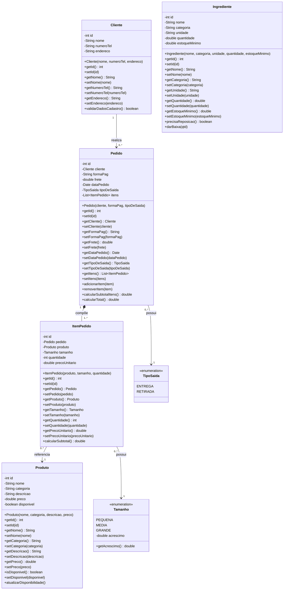

# 🍕 La Sottam Pizzaria

## Sistema de Gestão de Pedidos

Projeto desenvolvido para a disciplina de **Desenvolvimento de Sistemas (DS)** — **2° DSA**.

O sistema tem como objetivo auxiliar no gerenciamento de uma pizzaria, centralizando o cadastro de clientes, produtos, ingredientes e pedidos em uma aplicação Java integrada a um banco de dados MySQL.

---

## 👥 Participantes

- **Yago Costa** — UML e documentação
- **Vitor Matos** — Java e JDBC
- **Samira Toledo** — Java Swing e CRUD
- **Pedro Henrique** — Banco de Dados e SQL

---

## 📋 Solução Proposta

A pizzaria atualmente controla pedidos, clientes e estoque por meio de cadernos e planilhas manuais, o que gera pedidos duplicados ou perdidos, dificuldade para localizar o histórico de clientes, erros no cálculo do valor total e falta de controle de estoque.

A solução é um **Sistema Desktop de Gerenciamento Comercial**, desenvolvido em **Java** com interface gráfica em **Java Swing** e persistência de dados em banco relacional **MySQL**, acessado via **JDBC**. O sistema centraliza o cadastro de clientes, o catálogo de produtos, o controle de ingredientes em estoque e o registro de pedidos — incluindo tipo de saída (entrega ou retirada no balcão), forma de pagamento, frete e cálculo automático do total.

O projeto é organizado em camadas:

- **`model`** — classes de domínio que representam as entidades do negócio e suas regras de negócio.
- **`connection`** — responsável pela conexão JDBC com o banco MySQL.
- **`dao`** — classes de acesso a dados, isolando o restante do sistema de detalhes de persistência (SQL).
- **`view`** — telas Java Swing utilizadas pelos funcionários para interagir com o sistema.

Isso permite que o sistema evolua de forma incremental: a primeira etapa entrega a base do domínio e um CRUD completo de Clientes, e as etapas seguintes constroem os demais módulos sobre essa base.

---

## 🎯 Objetivos

O projeto tem como principais objetivos:

- Desenvolver uma aplicação Java integrada a um banco de dados MySQL
- Aplicar conceitos de Programação Orientada a Objetos
- Utilizar JDBC para comunicação entre Java e MySQL
- Implementar operações CRUD
- Desenvolver uma interface gráfica utilizando Java Swing
- Criar uma modelagem de banco de dados relacional
- Aplicar conceitos de UML na documentação do sistema

---

## 📌 Escopo do Sistema

### Funcionalidades contempladas

- Cadastro de clientes
- Consulta de clientes
- Alteração de clientes
- Exclusão de clientes
- Cadastro e manutenção de produtos
- Controle de disponibilidade dos produtos
- Cadastro de ingredientes
- Controle de estoque
- Definição de estoque mínimo
- Registro de pedidos
- Registro dos itens de cada pedido, com escolha de tamanho (com acréscimo de preço)
- Escolha da forma de pagamento
- Definição do tipo de saída:
  - Entrega
  - Retirada
- Cálculo de subtotal e total do pedido

### 🚧 Funcionalidades futuras

As seguintes funcionalidades não fazem parte da primeira versão do projeto, mas podem ser implementadas futuramente:

- Pagamento online integrado
- Aplicativo mobile
- Emissão de nota fiscal
- Sistema de autenticação de usuários e controle de funcionários
- Relatórios de vendas
- Dashboard administrativo
- Vínculo entre Produto e Ingrediente (baixa automática de estoque na venda)

---

# 🗄️ Banco de Dados

O sistema utiliza **MySQL** como banco de dados relacional.

## Entidades

### Cliente
```text
cliente
├── id (PK)
├── nome
├── numero_tel
└── endereco
```

### Produto
```text
produto
├── id (PK)
├── nome
├── categoria
├── descricao
├── preco
└── disponivel
```
> **Nota:** `tamanho` não é atributo do Produto — ele é escolhido no momento do pedido (com acréscimo de preço), por isso fica em `item_pedido`.

### Ingrediente
```text
ingrediente
├── id (PK)
├── nome
├── categoria
├── unidade
├── quantidade
└── estoque_minimo
```

### Pedido
```text
pedido
├── id (PK)
├── cliente_id (FK → cliente.id)
├── forma_pag
├── frete
├── data_pedido
└── tipo_saida
```
> **Nota:** O campo `tipo_saida` possui os seguintes valores: **ENTREGA** ou **RETIRADA**.

### Item do Pedido
```text
item_pedido
├── id (PK)
├── pedido_id (FK → pedido.id)
├── produto_id (FK → produto.id)
├── tamanho
├── quantidade
└── preco_unitario
```
> **Nota:** A relação entre `pedido` e `item_pedido` utiliza `ON DELETE CASCADE`, fazendo com que os itens sejam removidos automaticamente quando o pedido correspondente for excluído. O campo `tamanho` possui os valores **PEQUENA**, **MEDIA** ou **GRANDE**, cada um com um acréscimo de preço definido.

---

## 🔗 Relacionamentos

```text
CLIENTE
   │
   │ 1
   │
   │ 0..*
   ▼
PEDIDO
   │
   │ 1
   │
   │ 1..*
   ▼
ITEM_PEDIDO
   │
   │ *
   │
   │ 1
   ▼
PRODUTO
```

**Regras de Relacionamento:**
- Um **Cliente** pode possuir vários **Pedidos** (cada Pedido pertence a um Cliente).
- Um **Pedido** possui um ou mais **Itens** (cada ItemPedido pertence a um Pedido — relação de composição).
- Um **Produto** pode aparecer em vários **ItensPedido** (cada ItemPedido referencia um único Produto).

---

## 🧱 Script SQL (DDL)

```sql
CREATE DATABASE IF NOT EXISTS la_sottam_pizzaria;
USE la_sottam_pizzaria;

CREATE TABLE cliente (
    id INT AUTO_INCREMENT PRIMARY KEY,
    nome VARCHAR(120) NOT NULL,
    numero_tel VARCHAR(20) NOT NULL,
    endereco VARCHAR(200)
);

CREATE TABLE produto (
    id INT AUTO_INCREMENT PRIMARY KEY,
    nome VARCHAR(120) NOT NULL,
    categoria VARCHAR(60) NOT NULL,
    descricao VARCHAR(255),
    preco DECIMAL(10,2) NOT NULL,
    disponivel BOOLEAN NOT NULL DEFAULT TRUE
);

CREATE TABLE ingrediente (
    id INT AUTO_INCREMENT PRIMARY KEY,
    nome VARCHAR(120) NOT NULL,
    categoria VARCHAR(60) NOT NULL,
    unidade VARCHAR(20) NOT NULL,
    quantidade DECIMAL(10,2) NOT NULL DEFAULT 0,
    estoque_minimo DECIMAL(10,2) NOT NULL DEFAULT 0
);

CREATE TABLE pedido (
    id INT AUTO_INCREMENT PRIMARY KEY,
    cliente_id INT NOT NULL,
    forma_pag VARCHAR(40) NOT NULL,
    frete DECIMAL(10,2) NOT NULL DEFAULT 0,
    data_pedido DATETIME NOT NULL,
    tipo_saida ENUM('ENTREGA', 'RETIRADA') NOT NULL,
    CONSTRAINT fk_pedido_cliente FOREIGN KEY (cliente_id) REFERENCES cliente(id)
);

CREATE TABLE item_pedido (
    id INT AUTO_INCREMENT PRIMARY KEY,
    pedido_id INT NOT NULL,
    produto_id INT NOT NULL,
    tamanho ENUM('PEQUENA', 'MEDIA', 'GRANDE') NOT NULL,
    quantidade INT NOT NULL,
    preco_unitario DECIMAL(10,2) NOT NULL,
    CONSTRAINT fk_item_pedido FOREIGN KEY (pedido_id) REFERENCES pedido(id) ON DELETE CASCADE,
    CONSTRAINT fk_item_produto FOREIGN KEY (produto_id) REFERENCES produto(id)
);
```

---

## 📐 Diagrama de Classes UML



**Leitura das relações:**

- **Cliente → Pedido (1 : 0..\*)**: um cliente pode realizar vários pedidos; cada pedido pertence a exatamente um cliente.
- **Pedido ◆→ ItemPedido (composição, 1 : 1..\*)**: um item de pedido não existe sem o pedido ao qual pertence.
- **ItemPedido → Produto (0..\* : 1)**: um item referencia um produto do catálogo; o mesmo produto pode aparecer em vários itens de pedidos diferentes.
- **ItemPedido → Tamanho** e **Pedido → TipoSaida**: associações com os enums que representam escolhas fixas.

### Principais conceitos utilizados
- Encapsulamento
- Classes e objetos
- Construtores
- Getters e setters
- Associações e composição
- Enumerações
- Regras de negócio

---

## 💻 Tecnologias Utilizadas

- ☕ **Java**
- 🖥️ **Java Swing**
- 🔌 **JDBC**
- 🗄️ **MySQL**
- 📐 **UML**
- 💻 **Visual Studio Code**

---

## 📁 Estrutura do Projeto

```text
la-sottam-pizzaria/
│
├── src/
│   ├── model/
│   ├── dao/
│   ├── view/
│   └── connection/
│
├── lib/
│   └── dependencias/
│
├── bin/
│   └── arquivos compilados/
│
├── sql/
│   └── banco.sql
│
├── docs/
│   ├── diagrama-classes/
│   └── documentacao/
│
└── README.md
```

### Diretórios

| Diretório | Função |
| :--- | :--- |
| `src` | Código-fonte Java |
| `model` | Classes de modelo |
| `dao` | Acesso e operações no banco |
| `view` | Interfaces gráficas |
| `connection` | Conexão com o MySQL |
| `lib` | Dependências do projeto |
| `bin` | Arquivos compilados |
| `sql` | Scripts do banco de dados |
| `docs` | Documentação e diagramas |

---

## 👨‍💻 Divisão das Responsabilidades

### 👤 Pedro Henrique — Banco de Dados + SQL
Responsável pela implementação do banco de dados.
**Atividades:**
- Levantar as entidades necessárias
- Criar o modelo do banco e definir tabelas
- Definir PKs e FKs e criar o script SQL (DDL)
- Criar relacionamentos e definir restrições
- Testar o banco no MySQL e entregar o script SQL para integração com Java

### 👤 Yago Costa — UML + Documentação
Responsável pela documentação e pelo Diagrama de Classes UML.
**Atividades:**
- Definir as classes do sistema, atributos e construtores
- Definir métodos e regras de negócio
- Criar associações, multiplicidades, composição e outras relações
- Criar o Diagrama de Classes UML
- Elaborar a documentação do projeto

### 👤 Vitor Matos — Java + JDBC
Responsável pela estrutura do projeto Java e pela comunicação com o banco de dados.
**Atividades:**
- Criar a estrutura do projeto Java e organizar pacotes
- Criar a conexão com o MySQL e configurar JDBC
- Criar as classes de modelo e os DAOs
- Implementar operações: INSERT, SELECT, UPDATE, DELETE
- Testar a comunicação entre Java e MySQL

### 👤 Samira Toledo — Java Swing + CRUD
Responsável pela interface gráfica e pelo CRUD funcional.

**CRUD principal (1ª Etapa: Clientes)**
- ➕ Cadastrar cliente
- 🔎 Consultar clientes
- ✏️ Alterar cliente
- 🗑️ Excluir cliente

**Componentes Swing:** `JFrame`, `JPanel`, `JTextField`, `JTable`, `JButton` e componentes de validação.
> A interface será integrada aos métodos DAO desenvolvidos na camada Java/JDBC.

---

## 🔄 Fluxo de Desenvolvimento

```text
Pedro (Banco de Dados)
      ↓
Yago (UML + Documentação)
      ↓
Vitor (Java + JDBC + DAO)
      ↓
Samira (Swing + CRUD)
      ↓
Todos (Integração + Testes)
```
> Apesar dessa divisão, os integrantes devem trabalhar em conjunto para garantir que o banco, as classes Java e a interface estejam de acordo.

---

## 🚀 Primeira Etapa

Para a primeira etapa do projeto, o foco será desenvolver um **CRUD completo de Clientes**.

O CRUD deverá permitir o fluxo:
`Cadastrar` ➔ `Consultar` ➔ `Alterar` ➔ `Excluir`

A ideia é garantir que essa funcionalidade esteja totalmente funcional antes da implementação dos demais módulos. Posteriormente, o sistema poderá ser expandido para:

```text
                 LA SOTTAM PIZZARIA
                         │
         ┌───────────────┼───────────────┐
         ↓               ↓               ↓
     Clientes        Produtos       Ingredientes
         │               │               │
         └───────────────┼───────────────┘
                         ↓
                      Pedidos
                         │
                         ↓
                  Itens do Pedido
```

---

## 📚 Documentação

A documentação do projeto contempla:
- Solução Proposta
- Escopo do Sistema
- Script SQL (DDL)
- Diagrama de Classes UML
- Descrição das funcionalidades
- Estrutura do projeto

---

## 🛠️ Como Executar

### Pré-requisitos
Antes de executar o projeto, é necessário ter instalado:
- Java JDK
- MySQL
- Visual Studio Code (com Extensão Java para VS Code)
- Driver JDBC do MySQL

### Banco de Dados
1. Abra o MySQL.
2. Execute o script localizado em: `sql/banco.sql`
3. Verifique se o banco foi criado corretamente.
4. Configure as credenciais de acesso no projeto Java.

### Executando o projeto
1. Abra o projeto no Visual Studio Code.
2. Execute a classe principal da aplicação.

---

## 📌 Status do Projeto

🚧 **Em desenvolvimento**

- [x] Definição do escopo
- [x] Definição das entidades
- [x] Divisão das responsabilidades
- [x] Modelagem inicial do banco
- [x] Definição das classes UML
- [ ] Implementação do banco de dados
- [ ] Implementação da conexão JDBC
- [ ] Implementação dos DAOs
- [ ] Desenvolvimento da interface Swing
- [ ] CRUD de Clientes
- [ ] Testes de integração
- [ ] Documentação final

---

> **🍕 La Sottam Pizzaria**
> *Do pedido ao forno, tudo organizado em um só lugar.*
> Projeto acadêmico desenvolvido pela turma 2° DSA — Desenvolvimento de Sistemas.